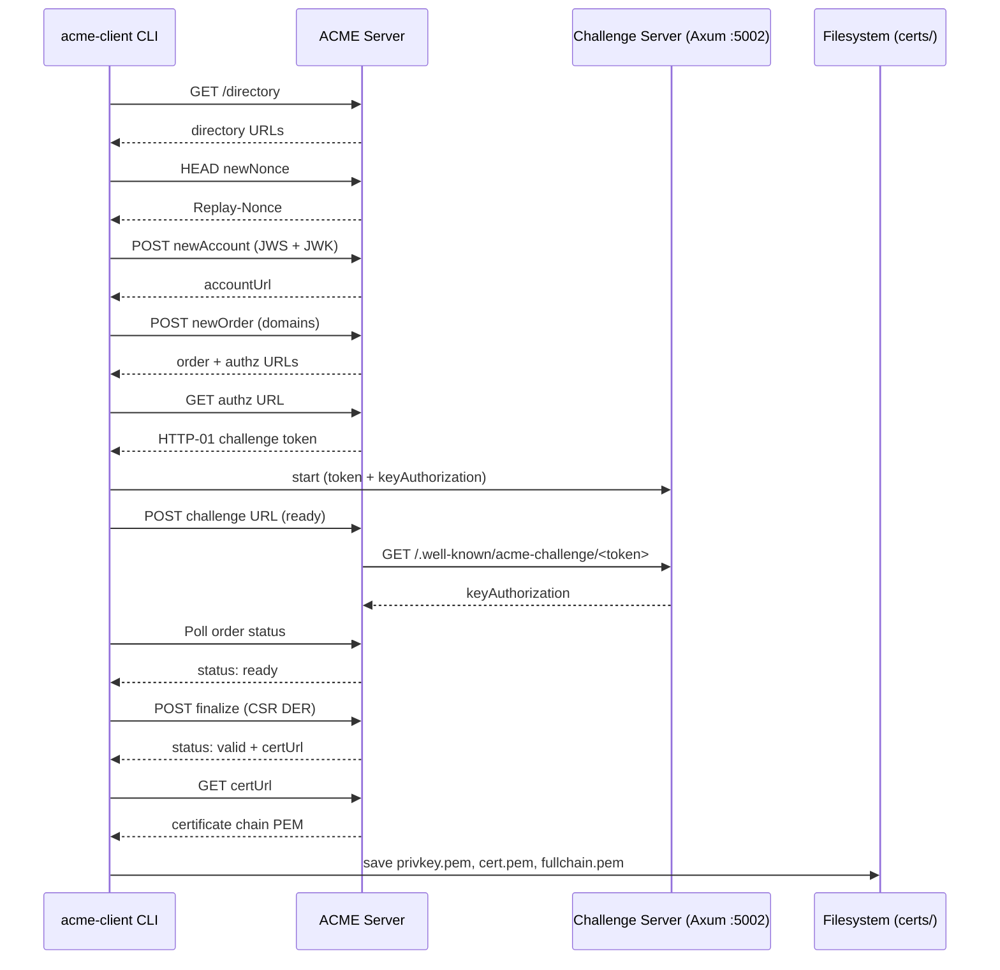
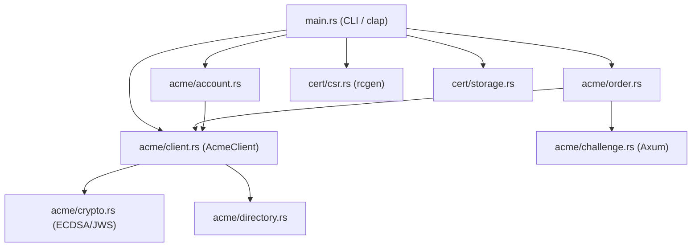

# ACME Client in Rust — Let's Encrypt / Pebble

 

A **Rust 2021 CLI tool** that implements the full ACME protocol (RFC 8555) to automatically obtain TLS certificates from Let's Encrypt (or a local Pebble test server), validating domain ownership via HTTP-01 challenges and persisting the resulting certificates to disk.

---

## Live Deploy

The project description page is publicly accessible at:

**<https://letsencrypt-client.deviaaps.com>**

Served by `nginx:alpine` behind Traefik v3.3 on a GCP VM (`34.174.56.186`).  
TLS certificate issued by Let's Encrypt (wildcard `*.deviaaps.com` via Cloudflare DNS-01).

---

## Commands Implemented

### `issue` — Obtain a New Certificate

Runs the complete ACME flow for one or more domains: account creation, order placement, HTTP-01 challenge resolution, CSR generation, finalization, and certificate download.

- Supports multi-domain SAN certificates (first domain becomes CN)
- Account persisted to `.accounts/account.json` for reuse
- Certificate written to `certs/<domain>/{privkey.pem, cert.pem, fullchain.pem}`

### `renew` — Re-issue an Existing Certificate

Same flow as `issue`; replaces stored certificates with freshly obtained ones.

### `show` — Inspect a Stored Certificate

Reads the stored certificate and displays subject, issuer, validity period (Not Before / Not After), serial number, and Subject Alternative Names.

---

## Project Structure

```
letsencrypt-client/
├── Cargo.toml                      # Package manifest and dependencies
├── Cargo.lock                      # Locked dependency versions
├── docker-compose.yml              # Pebble ACME server + challenge test server
├── docker/
│   ├── pebble-config.json          # Pebble server configuration
│   └── pebble-root-ca.pem          # Pebble self-signed CA (for curl --cacert)
├── scripts/
│   ├── add-hosts.sh                # Adds test domains to /etc/hosts
│   ├── fetch-pebble-ca.sh          # Downloads Pebble root CA from management API
│   └── test-issue.sh               # End-to-end certificate issuance smoke test
├── src/
│   ├── main.rs                     # CLI entrypoint (clap derive)
│   ├── acme/
│   │   ├── mod.rs                  # ACME module root
│   │   ├── client.rs               # AcmeClient — HTTP + JWS signing wrapper
│   │   ├── account.rs              # Account creation and disk persistence
│   │   ├── order.rs                # Order lifecycle, challenge solving, polling
│   │   ├── challenge.rs            # Axum-based HTTP-01 challenge server
│   │   ├── crypto.rs               # ECDSA P-256 keys, JWK, JWS (ES256)
│   │   └── directory.rs            # ACME directory fetch and deserialization
│   └── cert/
│       ├── mod.rs                  # Certificate module root
│       ├── storage.rs              # PEM persistence and certificate metadata display
│       └── csr.rs                  # CSR generation (rcgen, base64url DER)
└── test-app/
    ├── package.json                # Node.js dependencies (Express)
    └── server.js                   # HTTPS Express server using ACME-issued certificate
```

---

## Design Patterns / Architecture

**Builder / Client Wrapper** — `AcmeClient` (`src/acme/client.rs`) encapsulates the `reqwest::Client`, the ACME directory URLs, and the account key. All signed HTTP requests flow through a single `post()` method that fetches a fresh nonce and constructs JWS-signed bodies, keeping protocol concerns isolated from business logic.

**Repository / Storage Pattern** — `src/cert/storage.rs` and `src/acme/account.rs` own all disk I/O. Neither the order logic nor the CLI touches the filesystem directly; they delegate to `save_certificate` and `AccountInfo` respectively. This makes the persistence strategy easy to swap or test in isolation.

**Actor / Shared-State Server** — `ChallengeServer` (`src/acme/challenge.rs`) uses `Arc<Mutex<HashMap>>` to share token state between the Axum HTTP handler and the calling task. A `tokio::sync::oneshot` channel provides graceful shutdown, ensuring the challenge port is released before polling begins.

**Command Pattern (CLI)** — Each subcommand (`Issue`, `Renew`, `Show`) is a separate `clap` enum variant with its own argument set. `main.rs` dispatches to a dedicated async handler, keeping each command's workflow linear and self-contained.

---

## How It Works

The client implements the RFC 8555 ACME protocol in twelve sequential steps: it fetches the ACME directory, obtains a fresh replay nonce, creates (or loads) an account, places an order for the requested domains, starts a temporary Axum server to respond to `/.well-known/acme-challenge/<token>`, notifies the ACME server that challenges are ready, polls until the order reaches `valid`, generates a CSR with all domains in the SAN extension, finalizes the order, downloads the certificate chain, and writes `privkey.pem`, `cert.pem`, and `fullchain.pem` to `certs/<domain>/`.

```rust
// Issue a certificate — full ACME flow in a single call
acme-client issue \
  --domain test1.example.com \
  --domain www.test1.example.com \
  --email admin@example.com \
  --acme-url https://localhost:14000/dir \
  --insecure
```

All HTTP requests to the ACME server are signed with ECDSA P-256 (ES256) using JWS flattened serialization. The JWK thumbprint (SHA-256 of the canonical JWK) is appended to each challenge token as required by RFC 8555 §8.1.

---

## Architecture

### ACME Protocol Flow



### Module Dependency Graph



---

## Deployment

The project description page (`index.html`) is served by `nginx:alpine` behind Traefik v3.3 on a GCP VM.
Live URL: **<https://letsencrypt-client.deviaaps.com>**

### Prerequisites

- SSH access: `ssh -i C:\ubuntuiso\.ssh\vboxuser gcvmuser@34.174.56.186`
- Docker network `miseia-net` already running on the VM
- Traefik v3.3 with `cloudflare` cert resolver for `*.deviaaps.com`

### Deploy Steps

**1. Create remote directory** (first time only):

```bash
ssh -i C:\ubuntuiso\.ssh\vboxuser gcvmuser@34.174.56.186 \
  "mkdir -p ~/MISEIA_1-6-30-letsencrypt-client"
```

**2. Copy files to VM:**

```powershell
scp -i C:\ubuntuiso\.ssh\vboxuser `
  docker-compose.prod.yml index.html `
  gcvmuser@34.174.56.186:~/MISEIA_1-6-30-letsencrypt-client/
```

**3. Start the service:**

```bash
ssh -i C:\ubuntuiso\.ssh\vboxuser gcvmuser@34.174.56.186 \
  "cd ~/MISEIA_1-6-30-letsencrypt-client && \
   docker compose -f docker-compose.prod.yml up -d"
```

**4. Verify:**

```bash
# Container running
ssh gcvmuser@34.174.56.186 "docker ps --filter name=letsencrypt-client-web"

# HTTPS endpoint (PowerShell)
Invoke-WebRequest -Uri https://letsencrypt-client.deviaaps.com | Select StatusCode
```

`docker-compose.prod.yml` runs `nginx:alpine` with no exposed ports; Traefik routes HTTPS traffic and handles TLS termination via the `cloudflare` wildcard cert resolver.

---

## Getting Started

### Prerequisites

- [Rust](https://rustup.rs/) 1.70+ (edition 2021)
- [Docker](https://www.docker.com/) & Docker Compose (for local Pebble testing)
- Node.js 18+ (for the Express test app)
- Linux, macOS, or WSL on Windows

### Clone

```bash
git clone https://github.com/Jorgeaapaz/MISEIA_1-6-30-letsencrypt-client.git
cd MISEIA_1-6-30-letsencrypt-client
```

### Build

```bash
cargo build --release
# Binary: ./target/release/acme-client
```

### Lint & Format

```bash
# Check formatting
cargo fmt -- --check

# Lint with all warnings as errors
cargo clippy -- -D warnings
```

### Test

```bash
# Run all unit and integration tests
cargo test

# Run with output visible
cargo test -- --nocapture
```

### Local Testing with Pebble

**1. Start Pebble (ACME test server)**

```bash
docker-compose up -d
```

**2. Register test domains** (maps test domains to 127.0.0.1)

```bash
# Linux / macOS / WSL
bash scripts/add-hosts.sh

# Or manually add to /etc/hosts (C:\Windows\System32\drivers\etc\hosts on Windows):
# 127.0.0.1  test1.example.com  test2.example.com  www.test1.example.com
```

**3. Fetch the Pebble root CA** (needed for curl validation)

```bash
bash scripts/fetch-pebble-ca.sh
# Writes: docker/pebble-root-ca.pem
```

**4. Issue a certificate**

```bash
./target/release/acme-client issue \
  --domain test1.example.com \
  --domain www.test1.example.com \
  --email admin@example.com \
  --acme-url https://localhost:14000/dir \
  --insecure \
  --challenge-bind 0.0.0.0:5002
```

**5. Run the Express test app**

```bash
cd test-app
npm install
DOMAIN=test1.example.com npm start
```

### Against Let's Encrypt (production)

```bash
./target/release/acme-client issue \
  --domain yourdomain.com \
  --email you@yourdomain.com \
  --acme-url https://acme-v02.api.letsencrypt.org/directory
```

> Port 80 must be publicly reachable for HTTP-01 validation. Run as root or use `CAP_NET_BIND_SERVICE`.

---

## Example Output

### Certificate Issuance

```
$ ./target/release/acme-client issue --domain test1.example.com --acme-url https://localhost:14000/dir --insecure

INFO  Fetching ACME directory from https://localhost:14000/dir
INFO  Creating new ACME account
INFO  Account created: https://localhost:14000/acme/acct/1
INFO  Creating order for domains: ["test1.example.com"]
INFO  Starting HTTP-01 challenge server on 0.0.0.0:5002
INFO  Notifying ACME server that challenge is ready
INFO  Authorization valid for test1.example.com
INFO  Order is ready — finalizing with CSR
INFO  Certificate downloaded (2 PEM blocks)
INFO  Certificate saved to certs/test1.example.com/
      privkey.pem    ✓
      cert.pem       ✓
      fullchain.pem  ✓
```

### Certificate Inspection

```
$ ./target/release/acme-client show --domain test1.example.com

Subject:     CN=test1.example.com
Issuer:      CN=Pebble Intermediate CA
Not Before:  2026-05-20 10:00:00 UTC
Not After:   2026-08-18 10:00:00 UTC
Serial:      0x0034AF...
SAN:         test1.example.com, www.test1.example.com
```

### Express HTTPS App Verification

```bash
$ curl --cacert docker/pebble-root-ca.pem https://test1.example.com:8443/

{
  "domain": "test1.example.com",
  "issued_by": "Pebble Intermediate CA",
  "valid_from": "2026-05-20T10:00:00.000Z",
  "valid_until": "2026-08-18T10:00:00.000Z",
  "san": ["test1.example.com", "www.test1.example.com"],
  "host": "test1.example.com:8443"
}

$ curl --cacert docker/pebble-root-ca.pem https://test1.example.com:8443/health

{ "status": "ok", "timestamp": "2026-05-20T10:05:00.000Z" }
```

---

## Architecture Decisions

Key design choices are documented as ADRs in [`docs/decisions/`](docs/decisions/):

- [ADR-001: ECDSA P-256 for ACME account keys](docs/decisions/ADR-001-ecdsa-p256-account-key.md)
- [ADR-002: Axum for the HTTP-01 challenge server](docs/decisions/ADR-002-axum-challenge-server.md)
- [ADR-003: Per-domain PEM file storage](docs/decisions/ADR-003-per-domain-pem-storage.md)

---

## References

- [RFC 8555 — ACME Protocol](https://www.rfc-editor.org/rfc/rfc8555)
- [Pebble — ACME Test Server](https://github.com/letsencrypt/pebble)
- [rcgen — Rust CSR/Certificate Generation](https://docs.rs/rcgen)
- [ring — Rust Cryptography](https://docs.rs/ring)

---

## AI-Assisted Development

This project used Claude (claude-sonnet-4-6) to generate initial drafts of several modules.
The table below documents the critical review applied to AI output — the specific changes made
and the reasoning behind each decision.

| Component | AI Draft Approach | Change Made | Why |
|---|---|---|---|
| `acme/challenge.rs` — shutdown | Used `tokio::sync::mpsc` channel for graceful shutdown | Changed to `oneshot` channel | `mpsc` is multi-producer; a single shutdown signal has exactly one sender — `oneshot` encodes this in the type, preventing accidental multiple sends |
| `acme/challenge.rs` — token state | Passed token map as `Arc<Mutex<HashMap>>` function argument | Moved into `ChallengeServer` struct with `add_token()` method | Encapsulation: callers shouldn't manipulate the map directly; the struct owns its state |
| `cert/storage.rs` — `save_certificate` | Mixed directory creation and file writing inline in `main.rs` | Extracted to `save_certificate()` function returning `CertPaths` | Storage must be swappable without touching CLI logic; direct write couples the command handler to the filesystem |
| `src/main.rs` — `issue` and `renew` | Separate match arms with duplicated `issue_certificate()` calls | Merged into a single `Command::Issue { .. } \| Command::Renew { .. }` pattern | DRY — both subcommands share an identical flow; any future divergence belongs in flags, not duplicated arms |
| `acme/crypto.rs` — JWK order | JWK fields generated in insertion order | Verified canonical order (`crv`, `kty`, `x`, `y`) matches RFC 7638 §3.3 requirement for thumbprint stability | Wrong field order produces a different SHA-256 hash; the AI draft did not explicitly enforce canonical ordering |

**Components written or significantly revised without AI:**

- `scripts/test-issue.sh` — full end-to-end smoke test written manually to match the exact Pebble container environment and Windows/WSL path constraints
- `docker/pebble-config.json` — derived directly from Pebble documentation; AI draft used the wrong `httpPort` value for the challenge test server

---

## Updates — 2026-06-29 (Phase 1 — Linter + Tests)

- **`rustfmt.toml` added** — stable rustfmt configuration (`edition = "2021"`, `max_width = 100`). Run `cargo fmt -- --check` to verify formatting.
- **`clippy.toml` added** — Clippy configuration with `msrv = "1.70"`. Run `cargo clippy -- -D warnings` to lint.
- **`Cargo.toml` updated** — added `[lints]` section (`dead_code = "warn"`, `unwrap_used = "warn"`); added `tempfile = "3"` dev-dependency for test isolation.
- **17 automated tests added** — 14 unit tests across `crypto.rs` (5), `directory.rs` (2), `csr.rs` (3), `storage.rs` (4); 3 integration tests in `tests/integration_crypto.rs` (binary help, subcommand help, graceful error). Run with `cargo test`.
- **`tests/integration_crypto.rs` added** — integration tests that call the compiled binary via `CARGO_BIN_EXE_acme-client`.
- **Clippy fixes** — `challenge.rs` `unwrap()` calls annotated with `#[allow]` and reasoning comments; `main.rs` `&PathBuf` changed to `&std::path::Path`; `storage.rs` `unwrap()` replaced with `.context()`.

## Updates — 2026-06-29

- **`index.html` added** — static project description page at the repository root. Self-contained HTML5 with inline CSS (dark developer theme); covers features, ACME flow steps, CLI quick-start, tech stack badges, and links to the GitHub and GitLab repositories. No external dependencies.
- **`docs/prompts/` directory added** — stores disciplined feature prompt files. First entry: `feature_001_project_html_page_prompt.md`.
- **`.gitignore` updated** — `vid/` directory excluded from version control.

## Updates — 2026-06-09

- **`RUN_TEST_and_STOP.md` added** — comprehensive step-by-step guide (13 sections) covering: project architecture explanation for each component, one-time Windows setup, building the Rust binary, fetching the Pebble CA, testing existing certificates (test1, test2), issuing a simple cert (test3.example.com), issuing a multi-domain cert (test4.example.com + www.test4.example.com), understanding the three certificate files (`privkey.pem`, `cert.pem`, `fullchain.pem`), verifying with the Express test app, and stopping all services. Includes explicit terminal labels (PowerShell, Elevated PowerShell, Git Bash) for every command.
- **`docker-compose.yml` updated** — added `extra_hosts` entries for `test3.example.com`, `test4.example.com`, and `www.test4.example.com` so Pebble can resolve those domains to the host machine during HTTP-01 challenge validation.
- **`RUN_TEST_and_STOP.md` curl commands updated** — all HTTPS test `curl` calls now include `--ssl-no-revoke -v`. On Windows, curl uses the `schannel` SSL backend which hard-fails when a certificate has no CRL/OCSP URL (`CERT_TRUST_REVOCATION_STATUS_UNKNOWN`). `--ssl-no-revoke` disables revocation checking without bypassing CA verification; `-v` exposes TLS handshake details for debugging. A new Troubleshooting entry documents the root cause and the distinction from `-k`/`--insecure`.
