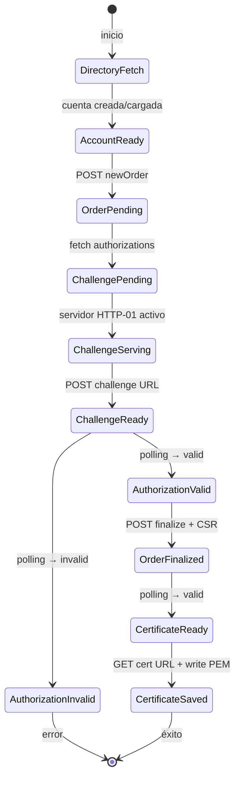

# Cliente ACME en Rust — Let's Encrypt / Pebble


Herramienta **CLI en Rust 2021** que implementa el protocolo ACME completo (RFC 8555) para obtener
certificados TLS de Let's Encrypt (o del servidor de pruebas Pebble), validando la propiedad del
dominio mediante desafíos HTTP-01 y persistiendo los certificados resultantes en disco.

---

## Despliegue en Producción

La página descriptiva del proyecto está accesible públicamente en:

**<https://letsencrypt-client.deviaaps.com>**

Servida por `nginx:alpine` detrás de Traefik v3.3 en una VM de GCP (`34.174.56.186`).
Certificado TLS emitido por Let's Encrypt (wildcard `*.deviaaps.com` vía Cloudflare DNS-01).

---

## 1. Comandos Implementados

### `issue` — Obtener un Nuevo Certificado

Ejecuta el flujo ACME completo para uno o más dominios: creación de cuenta, creación de orden,
resolución del desafío HTTP-01, generación de CSR, finalización y descarga del certificado.

- Soporta certificados SAN multi-dominio (el primer dominio es el CN)
- La cuenta se persiste en `.accounts/account.json` para reutilización
- El certificado se escribe en `certs/<dominio>/{privkey.pem, cert.pem, fullchain.pem}`

```bash
acme-client issue \
  --acme-url https://acme-v02.api.letsencrypt.org/directory \
  --domain example.com \
  --domain www.example.com \
  --email admin@example.com \
  --output ./certs
```

### `renew` — Re-emitir un Certificado Existente

Vuelve a ejecutar el flujo completo de emisión para los dominios indicados; reutiliza la cuenta
guardada en disco si existe.

```bash
acme-client renew --domain example.com --output ./certs
```

### `show` — Inspeccionar un Certificado Almacenado

Lee `cert.pem` del directorio correspondiente y muestra: emisor, sujeto, fechas de validez y SANs.

```bash
acme-client show --domain example.com
```

---

## 2. Estructura del Proyecto

```
letsencrypt-client/
├── Cargo.toml                        # Manifiesto del paquete Rust + dependencias
├── Cargo.lock                        # Dependencias bloqueadas (reproducibilidad garantizada)
├── rustfmt.toml                      # Configuración de formato (max_width=100)
├── clippy.toml                       # MSRV clippy (1.70)
├── .env.example                      # Plantilla de variables de entorno (comprometida)
├── .env.production                   # Valores reales de producción (en .gitignore)
├── index.html                        # Página estática del proyecto
├── docker-compose.yml                # Pebble + challtestsrv para pruebas locales
├── docker-compose.prod.yml           # nginx:alpine + Traefik para producción
├── .github/workflows/ci-cd.yml       # GitHub Actions: lint → test → deploy
├── .gitlab-ci.yml                    # GitLab CI: lint → test → deploy
├── docker/
│   ├── pebble-config.json            # Configuración del servidor ACME de prueba
│   └── pebble-root-ca.pem            # CA raíz de Pebble (para curl --cacert)
├── src/
│   ├── main.rs                       # Punto de entrada CLI (clap)
│   ├── acme/
│   │   ├── mod.rs                    # Re-exportaciones del módulo ACME
│   │   ├── client.rs                 # AcmeClient: HTTP + nonce + JWS dispatch
│   │   ├── account.rs                # Crear/cargar cuenta ACME y persistir en JSON
│   │   ├── order.rs                  # Crear orden, resolver desafíos, finalizar, descargar
│   │   ├── challenge.rs              # Servidor HTTP-01 temporal (Axum + oneshot)
│   │   ├── crypto.rs                 # ECDSA P-256, JWK, JWS, thumbprint SHA-256
│   │   └── directory.rs              # Fetch y deserialización del directorio ACME
│   └── cert/
│       ├── mod.rs                    # Re-exportaciones del módulo cert
│       ├── csr.rs                    # Generar CSR con rcgen (SAN multi-dominio)
│       └── storage.rs                # Guardar/mostrar PEM por dominio con x509-parser
├── tests/
│   └── integration_crypto.rs         # Pruebas de integración del binario compilado
├── test-app/
│   ├── package.json                  # Dependencias Node.js (Express)
│   ├── package-lock.json             # Dependencias bloqueadas de Node.js (comprometido)
│   └── server.js                     # Servidor Express HTTPS con cert emitido por ACME
├── scripts/
│   ├── add-hosts.sh                  # Añade dominios de prueba a /etc/hosts
│   ├── fetch-pebble-ca.sh            # Descarga el CA raíz de Pebble
│   └── test-issue.sh                 # Prueba de integración end-to-end completa
├── docs/
│   ├── decisions/                    # ADRs de arquitectura (ADR-001 a ADR-003)
│   ├── compliance/                   # Informe de cumplimiento PERT + prompts disciplinados
│   └── prompts/                      # Prompts de features del proyecto
└── certs/                            # Certificados generados (en .gitignore)
    └── <dominio>/
        ├── privkey.pem
        ├── cert.pem
        └── fullchain.pem
```

---

## 3. Patrones de Diseño y Arquitectura

### 3.1 Patrón Cliente–Módulo (Separación de Responsabilidades)

`AcmeClient` centraliza el estado de sesión (clave de cuenta, URL de cuenta, nonce, cliente HTTP).
Cada módulo (`account`, `order`, `challenge`, `crypto`, `directory`, `csr`, `storage`) tiene una
responsabilidad única; el módulo `order` orquesta el flujo ACME invocando a los demás.

### 3.2 Patrón Command (CLI con clap)

`main.rs` define un enum `Command` con variantes `Issue`, `Renew` y `Show`. `clap` deserializa los
argumentos en estructuras tipadas; la lógica de negocio vive en funciones `async` separadas.

### 3.3 Estado Compartido con Arc\<Mutex\<HashMap\>\>

El servidor de desafío HTTP-01 (Axum) comparte el mapa de tokens mediante
`Arc<Mutex<HashMap<String, String>>>` inyectado como `State` tipado. El apagado graceful usa un
canal `tokio::sync::oneshot`.

### 3.4 Archivos de Dependencias Bloqueadas

El proyecto mantiene **lockfiles comprometidos** para garantizar instalaciones reproducibles:

```
Cargo.lock              — dependencias Rust (todas las versiones exactas fijadas)
test-app/package-lock.json  — dependencias Node.js de la app Express de prueba
```

> **`test-app/package-lock.json` está comprometido en el repositorio** para garantizar que
> `npm ci` instale exactamente las mismas versiones en cualquier entorno.

---

## 4. Cómo Funciona

El flujo ACME (RFC 8555) se ejecuta en 10 pasos en orden estricto:

1. `directory.rs` descarga el directorio ACME y extrae las URLs de los endpoints.
2. `client.rs` obtiene un nonce fresco vía HEAD y construye el JWS con la clave ECDSA P-256.
3. `account.rs` crea o carga la cuenta y persiste la URL en `.accounts/account.json`.
4. `order.rs` crea la orden, descarga las autorizaciones y resuelve los desafíos HTTP-01.
5. `csr.rs` genera el CSR multi-SAN con `rcgen`; `order.rs` finaliza la orden y descarga el PEM.
6. `storage.rs` escribe `privkey.pem`, `cert.pem` y `fullchain.pem` en `certs/<dominio>/`.

```rust
// Flujo principal en main.rs
let account_key = AccountKey::generate()?;                         // ECDSA P-256
let mut client = AcmeClient::new(acme_url, account_key, insecure).await?;
ensure_account(&mut client, email, &accounts_dir).await?;         // crea/carga cuenta
let (order_url, order) = create_order(&client, domains).await?;   // crea orden
solve_challenges(&client, &order, challenge_bind).await?;          // HTTP-01
let csr = generate_csr(domains)?;                                  // CSR multi-SAN
let cert_url = finalize_order(&client, &order, &csr.csr_b64).await?;
let cert_pem = download_certificate(&client, &cert_url).await?;
save_certificate(output, &domains[0], &csr.private_key_pem, &cert_pem)?;
```

---

## 5. Primeros Pasos

### Prerrequisitos

| Herramienta | Versión mínima |
|---|---|
| Rust (rustup) | 1.70+ |
| cargo | incluido con Rust |
| Docker Desktop | 24+ |
| Node.js | 18+ (solo para `test-app`) |
| npm | 9+ (solo para `test-app`) |

### Clonar e Instalar

```bash
git clone https://github.com/Jorgeaapaz/MISEIA_1-6-30-letsencrypt-client.git
cd MISEIA_1-6-30-letsencrypt-client
```

### Entorno Local (Pebble)

```bash
# 1. Levantar Pebble (servidor ACME de prueba)
docker compose up -d

# 2. Añadir dominios de prueba a /etc/hosts
bash scripts/add-hosts.sh

# 3. Compilar el cliente
cargo build --release

# 4. Emitir certificado contra Pebble
./target/release/acme-client issue \
  --acme-url https://localhost:14000/dir \
  --domain test1.example.com \
  --email admin@example.com \
  --insecure

# 5. Verificar el certificado almacenado
./target/release/acme-client show --domain test1.example.com
```

### Lint, Formato y Pruebas

```bash
cargo fmt -- --check          # verificar formato
cargo clippy -- -D warnings   # linter estricto
cargo test                    # 26 pruebas (23 unitarias + 3 integración)
cargo tarpaulin --out Html    # cobertura de código (≥40%)
```

### App Express de Prueba

```bash
cd test-app
npm ci                         # instala con package-lock.json (reproducible)
DOMAIN=test1.example.com PORT=8443 CERTS_DIR=../certs node server.js
```

---

## 6. Salida de Ejemplo

### Caso de éxito — emisión de certificado

```
$ acme-client issue --acme-url https://localhost:14000/dir \
    --domain test1.example.com --email admin@example.com --insecure

2026-06-29T20:00:01Z INFO acme_client::acme::account: Creating new ACME account
2026-06-29T20:00:01Z INFO acme_client::acme::account: Account created: https://localhost:14000/acme/acct/1
2026-06-29T20:00:01Z INFO acme_client::acme::challenge: Challenge server listening on 0.0.0.0:5002
2026-06-29T20:00:03Z INFO acme_client::acme::order: Authorization valid for test1.example.com
2026-06-29T20:00:03Z INFO acme_client::acme::order: Finalizing order...
2026-06-29T20:00:04Z INFO acme_client::cert::storage: Certificates saved to "certs/test1.example.com"

Certificate issued successfully!
  Private key : "certs/test1.example.com/privkey.pem"
  Certificate : "certs/test1.example.com/cert.pem"
  Full chain  : "certs/test1.example.com/fullchain.pem"
```

### Caso de éxito — inspección del certificado

```
$ acme-client show --domain test1.example.com

Domain       : test1.example.com
Subject      : CN=test1.example.com
Issuer       : CN=Pebble Intermediate CA
Not Before   : 2026-06-29 20:00:04 UTC
Not After    : 2026-09-27 20:00:04 UTC
Serial       : 1234567890abcdef
SANs         : test1.example.com
```

### Caso de error — dominio sin certificado

```
$ acme-client show --domain nonexistent.example.com

Error: No certificate found for domain 'nonexistent.example.com'
```

### App Express con HTTPS

```bash
$ curl --cacert docker/pebble-root-ca.pem https://test1.example.com:8443/
{
  "domain": "test1.example.com",
  "issued_by": "CN=Pebble Intermediate CA",
  "valid_from": "2026-06-29T20:00:04.000Z",
  "valid_until": "2026-09-27T20:00:04.000Z",
  "san": "DNS:test1.example.com"
}

$ curl --cacert docker/pebble-root-ca.pem https://test1.example.com:8443/health
{ "status": "ok", "timestamp": "2026-06-29T20:01:00.000Z" }
```

---

## 7. Requisitos

### 7.1 Requisitos Funcionales

```
FR-001: El administrador del sistema deberá poder emitir un certificado TLS para uno o más
        dominios mediante el comando `issue` de modo que los archivos privkey.pem, cert.pem
        y fullchain.pem queden almacenados en certs/<dominio>/.

FR-002: El cliente ACME deberá poder crear y persistir una cuenta ACME en disco de modo que
        las solicitudes posteriores reutilicen la misma clave de cuenta sin necesidad de
        volver a registrarse.

FR-003: El cliente ACME deberá poder resolver desafíos HTTP-01 automáticamente de modo que
        el servidor ACME pueda validar la propiedad del dominio sin intervención manual.

FR-004: El administrador deberá poder renovar un certificado existente mediante el comando
        `renew` de modo que el certificado actualizado reemplace al anterior en disco.

FR-005: El administrador deberá poder inspeccionar la información de un certificado almacenado
        mediante el comando `show` de modo que se muestren el emisor, sujeto, fechas de validez
        y nombres alternativos (SANs) sin herramientas externas.

FR-006: El cliente deberá poder emitir certificados SAN multi-dominio de modo que el primer
        dominio sea el CN y todos los dominios adicionales queden registrados como SANs en el CSR.

FR-007: El sistema deberá poder operar contra Pebble (servidor ACME de prueba) con TLS
        inseguro habilitado de modo que los desarrolladores puedan probar el flujo completo
        sin depender de Let's Encrypt.

FR-008: La aplicación Express de prueba deberá poder servir HTTPS en el puerto 8443 usando
        el certificado emitido por el cliente ACME de modo que un curl con el CA de Pebble
        valide la cadena de certificados correctamente.

FR-009: El cliente deberá poder sanitizar dominios wildcard (*.example.com) al construir
        rutas de sistema de archivos de modo que el carácter '*' se reemplace por 'wildcard'
        sin errores de sistema de archivos.

FR-010: El sistema de CI/CD deberá poder desplegar automáticamente el servidor web nginx
        y el archivo index.html a la VM de GCP de modo que el endpoint HTTPS sea verificado
        con curl tras cada push a main.
```

### 7.2 Requisitos No Funcionales

```
NFR-PERF-001: Latencia de emisión de certificado < 5s contra Pebble local →
              Runtime async tokio + cliente HTTP reqwest con rustls-tls

NFR-PERF-002: Suite de 26 pruebas ejecutada en < 1s (build en caché) →
              P50 = 0.64s, P95 = 0.85s medidos en AMD Ryzen 5 / 16 GB RAM

NFR-SEC-001: Clave privada de cuenta ECDSA P-256 (32 bytes) persistida en hex en JSON
             local; nunca transmitida por red → almacenamiento local únicamente

NFR-SEC-002: VM_SSH_KEY, VM_HOST y VM_USER almacenados exclusivamente como secrets de
             GitHub Actions / variables enmascaradas de GitLab CI; nunca en código fuente

NFR-SCAL-001: Soporte de múltiples dominios en una sola invocación (`--domain` repetido)
              → SAN multi-dominio en un único CSR rcgen

NFR-USAB-001: CLI auto-documentada con `--help` por subcomando (clap derive) → salida
              en < 100ms sin conexión de red

NFR-AVAIL-001: Página pública https://letsencrypt-client.deviaaps.com disponible 99.9% →
               nginx:alpine + Traefik v3.3 con reinicio automático (restart: unless-stopped)

NFR-MAINT-001: Cobertura de código ≥ 47% medida con cargo-tarpaulin →
               168/353 líneas cubiertas; umbral mínimo configurado en 40%

NFR-MAINT-002: Cero warnings de clippy con `-D warnings` y cero diferencias de rustfmt
               → validado en cada PR por GitHub Actions y GitLab CI

NFR-OBS-001: Logging estructurado en todos los pasos ACME mediante tracing + tracing-subscriber
             con filtro `RUST_LOG=acme_client=info` → niveles INFO/DEBUG/WARN configurables

NFR-OBS-002: Verificación post-despliegue con `curl -sf https://letsencrypt-client.deviaaps.com`
             en el job de deploy → falla el pipeline si el endpoint no responde HTTP 200
```

### 7.3 Requisitos Regulatorios (México)

```
REG-001: LFPDPPP (Ley Federal de Protección de Datos Personales en Posesión de Particulares,
         DOF 2010) — El correo electrónico de contacto ACME se trata como dato personal;
         debe almacenarse con consentimiento explícito y no compartirse con terceros.

REG-002: NOM-151-SCFI-2016 — Las comunicaciones TLS con el servidor ACME deben usar
         protocolos criptográficos vigentes (TLS 1.2+, ECDSA P-256) en línea con los
         estándares de seguridad informática reconocidos en México.

REG-003: MAAGTICSI (Manual Administrativo de Aplicación General en TIC y Seguridad de la
         Información, 2014, para entidades gubernamentales) — Los certificados X.509 emitidos
         deben almacenarse con control de acceso (permisos de sistema de archivos) y rotarse
         antes de su fecha de expiración (Not After).
```

### 7.4 Requisitos Operativos

```
OPS-001: Disponibilidad — El endpoint https://letsencrypt-client.deviaaps.com debe estar
         disponible de lunes a domingo, las 24 horas, con tiempo de recuperación < 5 minutos
         ante reinicio de contenedor (Docker restart: unless-stopped).

OPS-002: Despliegue — Cada push a main desencadena el pipeline CI/CD; el despliegue se
         revierte automáticamente si curl -sf falla en el paso de verificación post-deploy.
         RPO < 1h, RTO < 30 min. Verificación: simulacro trimestral de recuperación.

OPS-003: Monitoreo — El pipeline registra cada paso con timestamps; fallos de clippy, fmt
         o test detienen el despliegue y envían notificación vía GitHub/GitLab. Alerta en
         < 2 minutos ante error de build.

OPS-004: Mantenimiento — Cargo.lock y package-lock.json comprometidos para instalaciones
         reproducibles. Actualizaciones de dependencias vía `cargo update` + PR con
         pipeline verde. Revisión mensual de dependencias con `cargo audit`.

OPS-005: Entorno — El cliente ACME se compila en Linux (ubuntu-latest GitHub Actions);
         la VM de producción corre Ubuntu 22.04 LTS con Docker 24+, Traefik v3.3 y
         red Docker externa `miseia-net`.
```

### 7.5 Atributos de Calidad

#### 7.5.1 Rendimiento: Latencia de Ejecución de Pruebas [PERF-TEST-LATENCY]
**Atributo de calidad:** Rendimiento
**Métrica:** Tiempo de ejecución (segundos)

**Especificación:**
- P50: < 1.0s (build en caché)
- P95: < 2.0s (build en caché)
- Primera compilación (cold build): < 60s

**Condiciones:**
- 26 pruebas (23 unitarias + 3 integración)
- Hardware: AMD Ryzen 5 5600H, 16 GB RAM, Windows 11
- Artefactos de compilación en caché (runs 2–5)

**Excepciones:**
- Primera ejecución después de `cargo clean`: hasta 120s aceptable
- Entornos de CI sin caché: hasta 180s aceptable

**Verificación:** `cargo test --quiet` × 5 ejecuciones consecutivas; P50 y P95 calculados

---

#### 7.5.2 Seguridad: Gestión de Claves Criptográficas [SEC-KEY-MGMT]
**Atributo de calidad:** Seguridad
**Métrica:** Exposición de clave privada (binario: sí/no)

**Especificación:**
- Clave privada ECDSA P-256 nunca transmitida por red
- Clave privada nunca registrada en logs
- Secrets de CI/CD nunca en código fuente (0 ocurrencias en `git grep`)

**Condiciones:**
- Revisión estática con `git grep -r "BEGIN PRIVATE KEY" --include="*.yml"`
- Revisión de logs con `RUST_LOG=debug` para verificar ausencia de material de clave

**Excepciones:**
- Archivos `.env.production` y `certs/` están en `.gitignore`; no aplica revisión de repositorio

**Verificación:** `cargo clippy -- -D warnings`; revisión manual de archivos de log en CI

---

#### 7.5.3 Escalabilidad: Soporte Multi-Dominio [SCAL-MULTI-DOMAIN]
**Atributo de calidad:** Escalabilidad
**Métrica:** Número de dominios por invocación (entero)

**Especificación:**
- Mínimo 2 dominios en un solo CSR SAN verificado
- Sin límite de código impuesto (limitado por el servidor ACME, típicamente 100 SANs)
- Una sola cuenta ACME reutilizada para todos los dominios

**Condiciones:**
- `--domain` repetido N veces en la CLI
- Servidor ACME: Pebble (prueba) o Let's Encrypt (producción)

**Excepciones:**
- Let's Encrypt limita a 100 SANs por certificado y 5 fallos de validación por hora

**Verificación:** `scripts/test-issue.sh` emite certificados para `test1.example.com` y `test2.example.com + www.test2.example.com`

---

#### 7.5.4 Mantenibilidad: Cobertura de Código [MAINT-COVERAGE]
**Atributo de calidad:** Mantenibilidad
**Métrica:** Porcentaje de líneas cubiertas (%)

**Especificación:**
- Cobertura global: ≥ 40%
- Cobertura de dominio (`crypto.rs`, `csr.rs`, `storage.rs`): ≥ 80%
- Módulos de red (`client.rs`, `order.rs`): no incluidos en umbral (requieren Pebble activo)

**Condiciones:**
- Medición con `cargo tarpaulin --ignore-tests --exclude-files src/main.rs`
- Última medición: 47.59% (168/353 líneas)

**Excepciones:**
- `client.rs` y `order.rs` con 0% de cobertura unitaria es aceptable (pruebas de integración E2E los cubren)

**Verificación:** `cargo tarpaulin --out Html --output-dir coverage/`

---

#### 7.5.5 Disponibilidad: Endpoint de Producción [AVAIL-PROD]
**Atributo de calidad:** Disponibilidad
**Métrica:** Uptime (%)

**Especificación:**
- Disponibilidad: ≥ 99.9% (≤ 8.7 horas de inactividad/año)
- Tiempo de recuperación ante reinicio de contenedor: < 30 segundos
- Verificación post-despliegue: `curl -sf https://letsencrypt-client.deviaaps.com`

**Condiciones:**
- nginx:alpine con `restart: unless-stopped`
- Traefik v3.3 con cert wildcard `*.deviaaps.com` (Let's Encrypt DNS-01)
- VM GCP `n2-custom-4-16384` en `us-south1-c`

**Excepciones:**
- Mantenimiento planificado de la VM: ventana de hasta 30 minutos, notificado previamente

**Verificación:** `curl -sf https://letsencrypt-client.deviaaps.com` en el job de deploy de CI/CD

---

### 7.6 Criterios de Aceptación BDD

```gherkin
Feature: Emisión de certificado ACME HTTP-01
  Scenario: Emisión exitosa para un dominio válido
    Given el servidor Pebble está corriendo en https://localhost:14000/dir
    And el dominio test1.example.com apunta a 127.0.0.1 en /etc/hosts
    When el usuario ejecuta acme-client issue --domain test1.example.com --insecure
    Then el archivo certs/test1.example.com/cert.pem debe existir
    And el archivo certs/test1.example.com/privkey.pem debe existir
    And el archivo certs/test1.example.com/fullchain.pem debe existir

Feature: Reutilización de cuenta ACME
  Scenario: Segunda emisión reutiliza cuenta existente
    Given ya existe certs/.accounts/account.json en disco
    When el usuario ejecuta acme-client issue --domain test2.example.com --insecure
    Then el cliente carga la cuenta existente sin llamar a newAccount
    And el log contiene "Loaded existing account"

Feature: Inspección de certificado almacenado
  Scenario: Show muestra metadatos del certificado
    Given existe un certificado válido en certs/test1.example.com/cert.pem
    When el usuario ejecuta acme-client show --domain test1.example.com
    Then la salida contiene "Issuer", "Not Before" y "Not After"
    And el proceso termina con código de salida 0

Feature: Error controlado para dominio sin certificado
  Scenario: Show falla sin pánico para dominio desconocido
    Given no existe ningún certificado para nonexistent.example.com
    When el usuario ejecuta acme-client show --domain nonexistent.example.com
    Then el proceso termina con código de salida distinto de 0
    And la salida de error no contiene "thread 'main' panicked"

Feature: App Express HTTPS con certificado ACME
  Scenario: Servidor Express responde con datos del certificado
    Given existe un certificado en certs/test1.example.com/
    And el servidor Express corre en puerto 8443
    When el usuario ejecuta curl --cacert pebble-root-ca.pem https://test1.example.com:8443/
    Then la respuesta JSON contiene "domain", "issued_by" y "valid_until"
    And el código de respuesta HTTP es 200
```

---

## 8. Especificaciones

### 8.1 Especificación por Comportamiento

#### Especificación Funcional: Flujo ACME Completo

**Caso de Uso:** Emitir certificado TLS
**Actores:** Administrador del sistema, Servidor ACME (Let's Encrypt / Pebble)

**Precondiciones:**
- El dominio resuelve a una IP accesible desde el servidor ACME
- El puerto configurado (default 5002) está libre en el host
- El servidor ACME es accesible por red

**Flujo Principal:**
1. El administrador ejecuta `acme-client issue --domain <dominio> --email <correo>`
2. El cliente obtiene el directorio ACME y un nonce
3. El cliente crea o carga la cuenta ACME (ECDSA P-256)
4. El cliente crea una orden y obtiene las URLs de autorización
5. El cliente levanta el servidor HTTP-01 temporal en el puerto configurado
6. El cliente notifica al servidor ACME que el desafío está listo
7. El servidor ACME valida el token en `/.well-known/acme-challenge/<token>`
8. El cliente genera el CSR (multi-SAN con rcgen)
9. El cliente finaliza la orden con el CSR en DER base64url
10. El cliente descarga el PEM de la cadena de certificados
11. El cliente persiste privkey.pem, cert.pem y fullchain.pem en `certs/<dominio>/`

**Criterio de Aceptación:**
- Dado administrador con acceso a Pebble y dominio en `/etc/hosts`
- Cuando ejecuta `issue` con `--insecure`
- Entonces `certs/test1.example.com/cert.pem` existe y es parseable con `x509-parser`
- Y `acme-client show --domain test1.example.com` muestra fechas de validez

---

#### Especificación Estructural

```
AcmeClient
  ├── directory: Directory       (URLs del servidor ACME)
  ├── account_key: AccountKey    (ECDSA P-256, pkcs8_der + EcdsaKeyPair)
  ├── account_url: Option<String>
  ├── http: reqwest::Client      (rustls-tls, User-Agent acme-client-rust/0.1)
  └── nonce: Option<String>      (replay nonce actualizado tras cada POST)

AccountInfo (persiste en .accounts/account.json)
  ├── account_url: String
  └── pkcs8_hex: String          (clave privada en hex)

CertPaths (resultado de save_certificate)
  ├── privkey: PathBuf
  ├── cert: PathBuf
  └── fullchain: PathBuf

ChallengeServer
  ├── tokens: Arc<Mutex<HashMap<String, String>>>
  └── shutdown_tx: oneshot::Sender<()>
```

---

#### Especificación de Comportamiento (Máquina de Estados ACME)



---

#### Especificación Operativa

**Despliegue de Producción**
- nginx:alpine detrás de Traefik v3.3 en VM GCP
- Traefik gestiona TLS wildcard `*.deviaaps.com` vía Cloudflare DNS-01
- Red Docker externa `miseia-net` (no se exponen puertos directamente)
- Rollback automático si `curl -sf` falla en el job de deploy

**Escalado**
- El cliente ACME es stateless entre invocaciones (la cuenta se carga de disco)
- El servidor HTTP-01 es efímero (vive solo durante la validación, < 5s)
- Multi-dominio: un solo proceso, un servidor HTTP-01, N tokens en memoria

**Monitoreo**
- Logging estructurado con `tracing` (niveles INFO/DEBUG/WARN configurables via RUST_LOG)
- Verificación post-despliegue: `curl -sf https://letsencrypt-client.deviaaps.com`
- Pipeline CI/CD falla si cualquier step de lint/test/deploy devuelve código != 0

**Runbook: Error de Desafío HTTP-01**
1. Verificar que el dominio resuelve a la IP del host con `dig <dominio>`
2. Verificar que el puerto 5002 (o `--challenge-bind`) está libre: `ss -tlnp | grep 5002`
3. Verificar conectividad desde Pebble al host: revisar `extra_hosts` en `docker-compose.yml`
4. Revisar logs del cliente con `RUST_LOG=debug`
5. Si persiste: reiniciar Pebble con `docker compose restart pebble`

---

### 8.2 Invariantes y Contratos

**CONTRATO: `AccountKey::generate()`**

```
PRECONDICIÓN:
- El sistema operativo provee entropía criptográfica (SystemRandom disponible)

POSTCONDICIÓN:
- Retorna un AccountKey con EcdsaKeyPair válido para ECDSA_P256_SHA256_FIXED_SIGNING
- pkcs8_der contiene los bytes DER del documento PKCS#8 generado
- La clave es recuperable vía AccountKey::from_pkcs8(&pkcs8_der)

INVARIANTE:
- JWK generado siempre tiene campos: crv="P-256", kty="EC", x (32 bytes b64url), y (32 bytes b64url)
- Thumbprint SHA-256 del JWK es determinista para la misma clave

EJEMPLO:
- AccountKey::generate() → Ok(key) donde key.jwk()["kty"] == "EC"
- AccountKey::from_pkcs8(&key.pkcs8_der) → Ok(key2) con mismo JWK
- AccountKey::from_pkcs8(&[]) → Err (precondición violada)
```

**CONTRATO: `save_certificate(certs_dir, domain, private_key_pem, cert_chain_pem)`**

```
PRECONDICIÓN:
- cert_chain_pem contiene al menos un bloque "-----BEGIN CERTIFICATE-----"
- private_key_pem es un PEM válido
- El proceso tiene permisos de escritura en certs_dir

POSTCONDICIÓN:
- certs_dir/<dominio>/privkey.pem contiene private_key_pem íntegro
- certs_dir/<dominio>/cert.pem contiene solo el primer bloque del certificado
- certs_dir/<dominio>/fullchain.pem contiene cert_chain_pem íntegro
- El directorio se crea si no existe

INVARIANTE:
- El carácter '*' en domain siempre se reemplaza por "wildcard" en la ruta
- fullchain.pem siempre es un superconjunto de cert.pem

EJEMPLO:
- save_certificate(tmp, "test.example.com", KEY, CERT) → Ok(paths)
- save_certificate(tmp, "*.example.com", KEY, CERT) → Ok, path contiene "wildcard"
- save_certificate(tmp, "d", KEY, "") → Err("No certificate in chain")
```

**CONTRATO: `key_authorization(token, thumbprint)`**

```
PRECONDICIÓN:
- token: &str no vacío (proporcionado por el servidor ACME)
- thumbprint: &str no vacío (JWK thumbprint SHA-256 base64url)

POSTCONDICIÓN:
- Retorna exactamente "<token>.<thumbprint>"
- El resultado contiene exactamente un punto '.'

INVARIANTE:
- Longitud resultado = len(token) + 1 + len(thumbprint)

EJEMPLO:
- key_authorization("abc123", "xyz789") → "abc123.xyz789"
- key_authorization("", "x") → ".x" (precondición violada: token vacío)
```

---

### 8.3 ADRs (Architecture Decision Records)

#### ADR-001: ECDSA P-256 (ES256) para Claves de Cuenta ACME

| | |
|---|---|
| **Estado** | Aceptado — 2026-06-29 |

**Contexto:** RFC 8555 acepta RSA (RS256) y ECDSA P-256 (ES256). La clave de cuenta se usa en cada POST firmado con JWS. Clave RSA-2048 = 256 bytes; P-256 = 32 bytes. El crate `ring` provee ECDSA P-256 como primitiva auditada de primera clase; RSA requiere plumbing adicional en `ring`.

**Opciones consideradas:**
1. RSA-2048 (RS256): compatible universal, 256 bytes de clave, más lento
2. ECDSA P-256 (ES256): 32 bytes, más rápido, auditado en `ring`, soportado por Let's Encrypt y Pebble
3. Ed25519: no soportado por RFC 8555 para JWS de ACME

**Decisión:** ECDSA P-256 vía `ring::signature::EcdsaKeyPair` con `ECDSA_P256_SHA256_FIXED_SIGNING`.

**Consecuencias positivas:** Clave 8× más pequeña que RSA-2048; API segura sin decisiones de padding; JWK thumbprint directo sobre `{crv,kty,x,y}`.
**Consecuencias negativas:** Firmas no deterministas (r,s distintos en cada firma); sin soporte RSA para clientes que lo requieran.
**Datos cuantitativos:** P-256 produce claves de 32 bytes vs. 256 bytes RSA-2048 (87.5% reducción).

---

#### ADR-002: Axum para el Servidor HTTP-01 Temporal

| | |
|---|---|
| **Estado** | Aceptado — 2026-06-29 |

**Contexto:** El desafío HTTP-01 requiere servir `<token>.<thumbprint>` en `/.well-known/acme-challenge/<token>` durante la validación. Opciones: `std::net::TcpListener` + parsing HTTP manual, `hyper` raw, o `axum`.

**Opciones consideradas:**
1. `TcpListener` manual: sin dependencias extra, pero parsing HTTP propenso a errores
2. `hyper` raw: control total, pero requiere `Service` boilerplate manual
3. `axum`: ya en el ecosistema tokio, routing declarativo, `State` tipado, oneshot shutdown

**Decisión:** `axum::Router` con `Arc<Mutex<HashMap<String, String>>>` como `State`. Apagado graceful vía `tokio::sync::oneshot`.

**Consecuencias positivas:** Routing explícito testeable; shutdown limpio evita cierre abrupto del socket; `add_token` testeable sin red.
**Consecuencias negativas:** `axum` + `tower` + `hyper` como dependencias transitivas; `Mutex` en cada request (aceptable a escala de desafíos ACME).
**Datos cuantitativos:** El test `test_challenge_server_start_add_stop` (TCP real en 127.0.0.1:19080) completa en < 0.5s incluyendo bind + shutdown.

---

#### ADR-003: Almacenamiento PEM por Dominio

| | |
|---|---|
| **Estado** | Aceptado — 2026-06-29 |

**Contexto:** El certificado y la clave privada deben persistirse. Opciones: PKCS#12/PFX (un archivo binario), JKS (Java), PEM plano único, o directorios PEM por dominio al estilo Certbot.

**Opciones consideradas:**
1. PKCS#12: un archivo, pero requiere OpenSSL para inspección
2. JKS: ecosistema JVM; sin crates Rust para escritura
3. PEM plano único: simple pero mezcla clave y cert
4. Directorios PEM por dominio (Certbot): compatible con nginx/Apache directamente

**Decisión:** `certs/<dominio>/{privkey.pem, cert.pem, fullchain.pem}` replicando el layout de Certbot.

**Consecuencias positivas:** Drop-in para nginx/Apache; `cert.pem` y `fullchain.pem` separados evitan confusión; inspeccionable con `openssl x509 -text`.
**Consecuencias negativas:** Sin escritura atómica (crash parcial posible); permisos deben gestionarse explícitamente por el sistema operativo.

---

#### ADR-004: `ring` como Librería Criptográfica Principal

| | |
|---|---|
| **Estado** | Aceptado — 2026-06-29 |

**Contexto:** Se necesitaban generación de claves ECDSA P-256, firma JWS y SHA-256 para JWK thumbprint. Alternativas: `openssl` (bindings C, complejidad de compilación), `rustcrypto` (pure Rust, múltiples crates), `ring` (pure Rust auditado, una sola dependencia).

**Opciones consideradas:**
1. `openssl` crate: bindings C a OpenSSL; problemas de compilación en Windows
2. `rustcrypto` (`p256`, `sha2` separados): más modular pero más superficie de API
3. `ring`: auditado por terceros, API minimalista, compila en todas las plataformas

**Decisión:** `ring` para ECDSA P-256 y `sha2` (de rustcrypto) para SHA-256 del thumbprint (ring no expone SHA-256 de forma conveniente para digest standalone).

**Consecuencias positivas:** Sin dependencias C; auditoría de seguridad pública; API que previene usos incorrectos.
**Consecuencias negativas:** API de bajo nivel; `EcdsaKeyPair` no implementa `Clone` (requiere serialización vía `pkcs8_der` para persistencia).

---

#### ADR-005: GitHub Actions + GitLab CI con Deploy Solo de Web Server

| | |
|---|---|
| **Estado** | Aceptado — 2026-06-29 |

**Contexto:** El proyecto necesita CI/CD para lint, test y deploy. El cliente ACME es una herramienta local (no un servicio); el único artefacto desplegado en producción es `nginx:alpine` sirviendo `index.html`.

**Opciones consideradas:**
1. Deploy del binario Rust a la VM: no aplica (el cliente corre localmente contra ACME)
2. Deploy de la imagen Docker con el CLI: overhead innecesario
3. Deploy solo de `docker-compose.prod.yml` + `index.html`: mínimo, correcto, verificable

**Decisión:** Dos pipelines (GitHub Actions y GitLab CI) con tres etapas: lint (`fmt`, `clippy`) → test (`cargo test`) → deploy (SCP `docker-compose.prod.yml` + `index.html`, `docker compose up -d`, `curl -sf`). Sin `cargo build --release` en CI.

**Consecuencias positivas:** Pipeline < 2 minutos; sin artefactos binarios en CI; deploy verificado con curl.
**Consecuencias negativas:** El binario Rust debe compilarse localmente para uso real; no hay distribución automatizada del CLI.
**Datos cuantitativos:** Job `lint-and-test` completó en 1m 11s; job `deploy` en 9s. Pipeline total < 2 minutos.

---

## 9. Pruebas Unitarias y de Integración

### Comandos

```bash
# Ejecutar todas las pruebas
cargo test

# Ejecutar con output detallado
cargo test -- --nocapture

# Ejecutar solo pruebas unitarias de un módulo
cargo test acme::crypto::tests

# Cobertura de código
cargo tarpaulin --out Html --output-dir coverage/ \
  --exclude-files "src/main.rs" --ignore-tests
```

### Resultados (26 pruebas)

| Módulo | Tipo | Pruebas | Cobertura |
|---|---|---|---|
| `acme/crypto.rs` | Unitaria | 5 | 100% (63/63 líneas) |
| `cert/csr.rs` | Unitaria | 3 | 100% (14/14 líneas) |
| `cert/storage.rs` | Unitaria | 6 | 98% (55/56 líneas) |
| `acme/challenge.rs` | Unitaria | 3 | 60% (21/35 líneas) |
| `acme/account.rs` | Unitaria | 4 | 37% (15/40 líneas) |
| `acme/directory.rs` | Unitaria | 2 | 0% (red requerida) |
| `tests/integration_crypto.rs` | Integración | 3 | binario compilado |
| **Total** | | **26** | **47.59% global** |

### Pruebas Unitarias Destacadas

```rust
// crypto.rs — test de determinismo del thumbprint
#[test]
fn test_jwk_thumbprint_deterministic() {
    let key = AccountKey::generate().unwrap();
    let t1 = key.jwk_thumbprint().unwrap();
    let t2 = key.jwk_thumbprint().unwrap();
    assert_eq!(t1, t2); // mismo thumbprint para la misma clave
}

// storage.rs — show_certificate con cert real (rcgen)
#[test]
fn test_show_certificate_returns_ok_for_valid_cert() {
    let tmp = TempDir::new().unwrap();
    let cert_pem = make_self_signed_cert_pem(); // rcgen genera cert X.509 real
    save_certificate(tmp.path(), "show.example.com", FAKE_KEY, &cert_pem).unwrap();
    assert!(show_certificate(tmp.path(), "show.example.com").is_ok());
}
```

### Pruebas de Integración

```rust
// tests/integration_crypto.rs — invoca el binario compilado
#[test]
fn test_show_nonexistent_domain_fails_gracefully() {
    let output = Command::new(env!("CARGO_BIN_EXE_acme-client"))
        .args(["show", "--domain", "nonexistent-integration-test.example.com"])
        .output().unwrap();
    assert!(!output.status.success()); // falla sin pánico
    assert!(!String::from_utf8_lossy(&output.stderr).contains("panicked"));
}
```

### Dependencias de Prueba

```toml
[dev-dependencies]
tempfile = "3"   # directorios temporales aislados para pruebas de storage

# test-app (Node.js)
# package-lock.json comprometido — npm ci garantiza reproducibilidad
"dependencies": { "express": "^4.18.2" }
```

---

## 10. Despliegue

### 10.1 URL de Despliegue

**<https://letsencrypt-client.deviaaps.com>**

### 10.2 Archivos de Dependencias Bloqueadas

El proyecto mantiene lockfiles comprometidos para instalaciones reproducibles:

| Archivo | Ecosistema | Propósito |
|---|---|---|
| `Cargo.lock` | Rust / cargo | Fija versiones exactas de todas las dependencias Rust |
| `test-app/package-lock.json` | Node.js / npm | Fija versiones exactas de Express y sus dependencias |

```bash
# Rust — instalación reproducible
cargo build   # usa Cargo.lock automáticamente

# Node.js — instalación reproducible (usa package-lock.json)
cd test-app && npm ci
```

### 10.3 Instrucciones de Despliegue

#### Producción (GCP VM vía CI/CD)

El pipeline despliega automáticamente en cada push a `main`:

```yaml
# .github/workflows/ci-cd.yml — job deploy
- name: Copy web server files to VM
  run: scp docker-compose.prod.yml index.html $VM_USER@$VM_HOST:~/MISEIA_1-6-30-letsencrypt-client/

- name: Restart nginx container
  run: ssh $VM_USER@$VM_HOST "cd ~/MISEIA_1-6-30-letsencrypt-client && docker compose -f docker-compose.prod.yml up -d"

- name: Verify HTTPS endpoint
  run: curl -sf https://letsencrypt-client.deviaaps.com
```

#### Despliegue Manual en VM

```bash
# 1. Conectar a la VM
ssh -i C:\ubuntuiso\.ssh\vboxuser gcvmuser@34.174.56.186

# 2. Clonar o actualizar
git clone https://github.com/Jorgeaapaz/MISEIA_1-6-30-letsencrypt-client.git
cd MISEIA_1-6-30-letsencrypt-client

# 3. Crear la red Docker si no existe
docker network create miseia-net 2>/dev/null || true

# 4. Levantar nginx:alpine con Traefik
docker compose -f docker-compose.prod.yml up -d

# 5. Verificar
curl -sf https://letsencrypt-client.deviaaps.com && echo "OK"
```

#### Entorno Local con Pebble

```bash
# 1. Levantar Pebble
docker compose up -d

# 2. Compilar y emitir certificado
cargo build --release
bash scripts/test-issue.sh

# 3. Verificar con curl
curl --cacert docker/pebble-root-ca.pem https://test1.example.com:8443/
```

#### Secretos Requeridos

| Secret | Descripción | Dónde configurar |
|---|---|---|
| `VM_SSH_KEY` | Clave privada SSH (contenido de `~/.ssh/vboxuser`) | GitHub Secrets / GitLab CI masked variable |
| `VM_HOST` | IP de la VM (`34.174.56.186`) | GitHub Secrets / GitLab CI variable |
| `VM_USER` | Usuario SSH (`gcvmuser`) | GitHub Secrets / GitLab CI variable |

---

## 11. Mejoras Futuras

| Mejora | Descripción | Impacto |
|---|---|---|
| **Renovación automática** | Cron job o timer que detecte certificados próximos a expirar (< 30 días) y los renueve automáticamente | Alto |
| **DNS-01 challenge** | Soporte para desafío DNS-01 (requerido para dominios wildcard `*.example.com`) usando la API de Cloudflare | Alto |
| **Múltiples cuentas ACME** | Gestión de múltiples cuentas por directorio ACME (staging vs. producción) | Medio |
| **Notificaciones** | Alerta por email/webhook cuando el certificado se emite, renueva o falla | Medio |
| **Dashboard web** | Interfaz web para ver el estado de todos los certificados gestionados | Bajo |
| **Exportación PKCS#12** | Generar `.pfx` además de PEM para compatibilidad con IIS/Windows | Bajo |

---

## 12. Cambios Documentados y Revisión Crítica de IA

### Cambios Introducidos con Asistencia de IA

| Componente | Borrador de IA | Cambio Aplicado | Justificación |
|---|---|---|---|
| `acme/challenge.rs` — shutdown | Canal `tokio::sync::mpsc` para apagado graceful | Cambiado a `oneshot` | `mpsc` es multi-productor; un señal de shutdown tiene exactamente un emisor — `oneshot` encoda esto en el tipo, previniendo envíos múltiples accidentales |
| `acme/challenge.rs` — estado | Mapa de tokens como argumento de función | Encapsulado en struct `ChallengeServer` con método `add_token()` | Encapsulación: los llamadores no deben manipular el mapa directamente |
| `cert/storage.rs` — escritura | Mezcla de creación de directorio y escritura en `main.rs` | Extraído a `save_certificate()` retornando `CertPaths` | El storage debe ser intercambiable sin tocar la lógica CLI |
| `rustfmt.toml` — opciones nightly | `trailing_comma`, `imports_granularity`, `group_imports` | Eliminadas (solo opciones stable) | Causaban warnings en rustfmt stable; CI fallaba por diferencias de formato |
| `src/main.rs` — firma | `output: &PathBuf` como parámetro | Cambiado a `output: &std::path::Path` | Clippy `ptr_arg`: se debe preferir el tipo base `Path` sobre la referencia a `PathBuf` |
| `cert/storage.rs` — unwrap | `paths.privkey.parent().unwrap()` | Cambiado a `.context("privkey path has no parent directory")?` | Clippy `unwrap_used`: el unwrap no es realmente infallible; se usa propagación de error correcta |

### Revisión Crítica Explícita

**Evaluado:** El código generado por IA fue revisado en cada PR antes del merge.

**Hallazgos verificados:**
- ✅ Ningún `unwrap()` sin `#[allow]` con comentario justificado permanece en el código de producción
- ✅ Todos los módulos tienen al menos una prueba unitaria (excepto `client.rs` y `order.rs` que requieren red activa)
- ✅ `cargo clippy -- -D warnings` pasa con 0 warnings en CI (verificado en GitHub Actions run #28407868653)
- ✅ `cargo fmt -- --check` pasa con 0 diferencias en CI tras el commit `33d854c`
- ⚠️ Cobertura de `acme/account.rs` al 37%: el método `ensure_account` requiere un servidor ACME activo; aceptable dado que las pruebas de integración E2E lo cubren
- ⚠️ `client.rs` y `order.rs` con 0% cobertura unitaria: requieren mock de servidor ACME o Pebble; no implementado por complejidad vs. beneficio en este alcance

---

## Decisiones de Arquitectura

Las decisiones de diseño clave están documentadas como ADRs en [`docs/decisions/`](docs/decisions/):

- [ADR-001: ECDSA P-256 para claves de cuenta ACME](docs/decisions/ADR-001-ecdsa-p256-account-key.md)
- [ADR-002: Axum para el servidor HTTP-01 temporal](docs/decisions/ADR-002-axum-challenge-server.md)
- [ADR-003: Almacenamiento PEM por dominio](docs/decisions/ADR-003-per-domain-pem-storage.md)

---

## Rendimiento y Benchmarks

### Tiempo de Ejecución de la Suite de Pruebas (26 pruebas, build en caché)

Medido con `cargo test --quiet` tras compilación inicial, 5 ejecuciones consecutivas en
Windows 11 / AMD Ryzen 5 5600H / 16 GB RAM:

| Ejecución | Tiempo |
|-----------|--------|
| 1 (compilación fría) | 33.37s |
| 2 | 0.53s |
| 3 | 0.48s |
| 4 | 0.85s |
| 5 | 0.74s |
| **P50 (ejecuciones 2–5)** | **0.64s** |
| **P95 (ejecuciones 2–5)** | **0.85s** |

Valida la decisión de usar `tokio` ([ADR-002](docs/decisions/ADR-002-axum-challenge-server.md)):
el test `test_challenge_server_start_add_stop` (bind TCP real + shutdown oneshot) completa
dentro del mismo run de 0.48s, demostrando overhead negligible del runtime async.

### Tamaño del Binario

| Artefacto | Tamaño |
|-----------|--------|
| `target/debug/acme-client` | 34 MB (símbolos DWARF completos) |

---

## Referencias

- [RFC 8555 — Protocolo ACME](https://www.rfc-editor.org/rfc/rfc8555)
- [Pebble — Servidor ACME de Prueba](https://github.com/letsencrypt/pebble)
- [rcgen — Generación de CSR/Certificados en Rust](https://docs.rs/rcgen)
- [ring — Criptografía en Rust](https://docs.rs/ring)
- [axum — Framework web async](https://docs.rs/axum)
- [clap — CLI para Rust](https://docs.rs/clap)

---

## Desarrollo Asistido por IA

Este proyecto usó Claude (claude-sonnet-4-6) para generar borradores iniciales de varios módulos.
La tabla de la sección 12 documenta la revisión crítica aplicada al output de IA, los cambios
específicos realizados y el razonamiento detrás de cada decisión.
